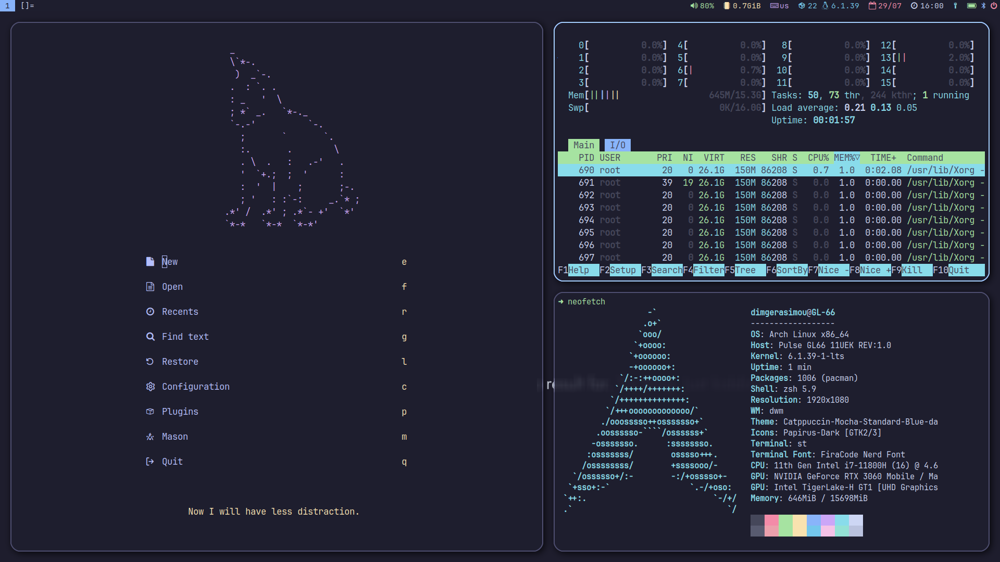

# dwm - dynamic window manager

dwm is an extremely fast, small, and dynamic window manager for X.
This is a heavily patched version with all the scripts i use for my configuration in daily use.

## Requirements

In order to build dwm you need the Xlib header files and the predifined fonts.
To build on Arch Linux as is, the following packages are required:

- ttf-font-awsome
- ttf-jetbrains-mono-nerd
- libx11
- libxinerama
- libxft

## Installation
To install, just execute:
```bash
sudo make clean install
```

## Patches

- swallow
- restartsig
- attachdirection
- xresources
- status2d
- systray
- decorhints
- noborderselflickerfix
- rotatestack
- vanitygaps
- hidevacanttabs
- restoreafterrestart
- focusonclick
- adjacenttag
- scratchpad
- barpadding
- statuscmd

## Running dwm
In order to be run through a login manager, a desktop file must be created at `/usr/share/xsessions`.

If not using one, it can be executed by adding `exec dwm` in the .xinitrc file.

For a statusbar any can be installed but you can use [my version](https://github.com/dimgerasimou/dwm-asyncblocks 'dwm-asyncblocks') of dwmblocks.

See also [my binaries](https://github.com/dimgerasimou/binaries 'binaries')

## Configuration

The configuration of dwm is done by creating a custom config.h and (re)compiling the source code.

## Examples



